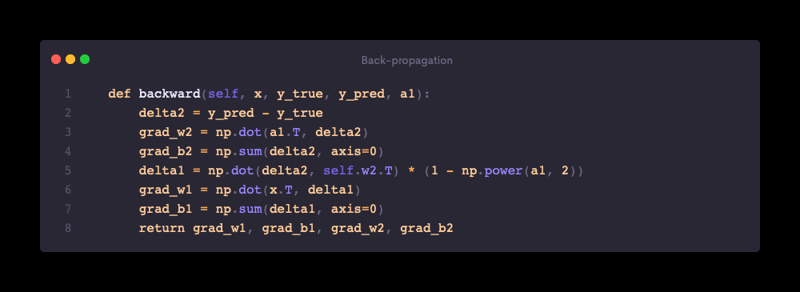

# MNIST from scratch

I've been feeling like a fraud lately, always relying on libraries to do the heavy lifting for me when it comes to machine learning. So, I decided to take matters into my own hands and build a neural network from scratch to classify the MNIST dataset. After a good amount of debugging code and staring at matrices, I'm very pleased with the performance of my model! Here's a summary of the code:

## Initialisation

The constructor method initialises the neural network object with three attributes: the size of the input layer, the size of the hidden layer, and the size of the output layer. It also initializes the weights and biases for the two layers using random values.

## Forward Pass

The forward method performs a forward pass through the neural network with the input x. It computes the output of the network by applying a dot product between the input and the first set of weights, adding the first set of biases, applying a non-linear activation function (tanh), computing the output of the second layer by applying a dot product between the output of the first layer and the second set of weights, adding the second set of biases, and finally applying the softmax function.

## Back-propagation

The backward method performs a backward pass through the neural network to compute the gradients of the loss with respect to the weights and biases. It uses the predicted labels y_pred, the true labels y_true, the input x, and the output of the first layer a1 as inputs to compute the gradients.

## Training

This method trains the neural network on a given dataset of input images x_train and labels y_train. It uses batch gradient descent with a given learning rate and batch size, and trains the network for a given number of epochs. For each batch, it performs a forward pass, computes the loss, performs a backward pass, and updates the weights and biases.

## Testing

evaluate(self, x_test, y_test): This method evaluates the performance of the neural network on a given test dataset of input images x_test and labels y_test. It computes the accuracy of the network by comparing the predicted labels with the true labels, and prints the test accuracy in percentage.

